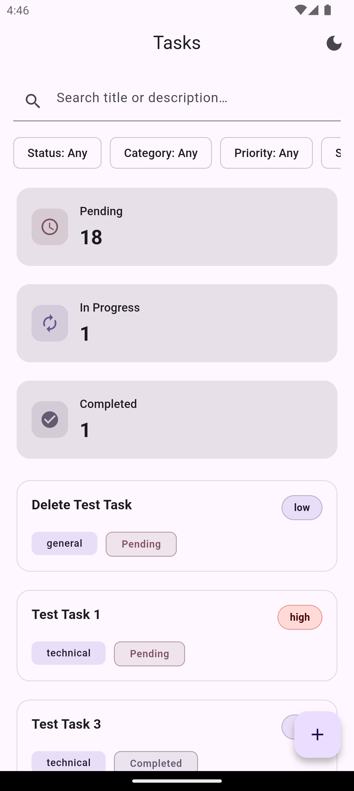
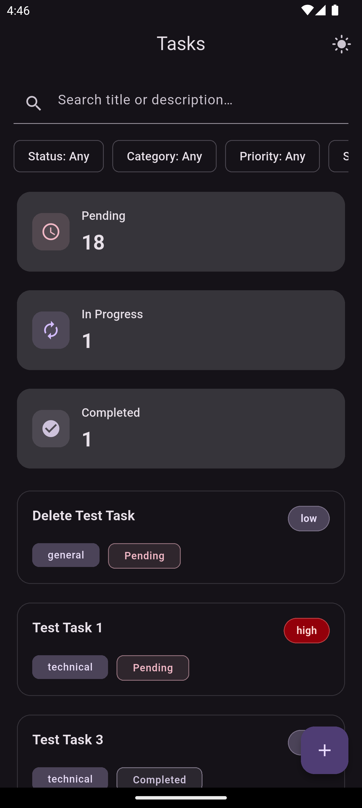
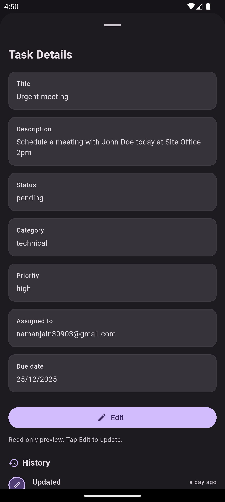
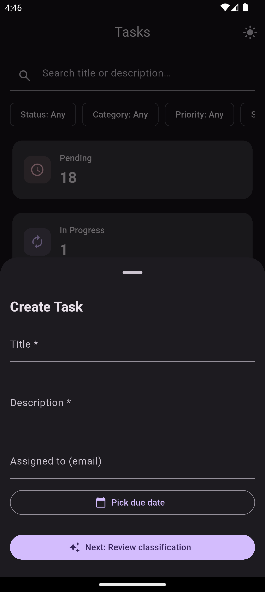
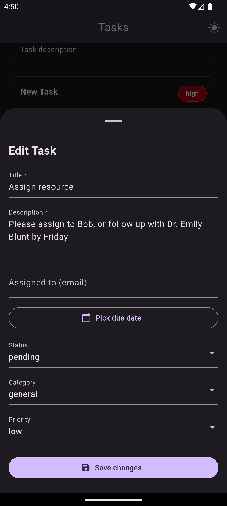

# Task Management System

A comprehensive full-stack task management application built with Flutter and Node.js, featuring AI-powered task classification, real-time connectivity detection, and complete task lifecycle management with full audit history.

---

## 📋 Project Overview

### What
A production-ready task management system that enables users to create, organize, track, and manage tasks with intelligent auto-classification. The application provides:

- **Intelligent Task Classification**: Rule-based intelligent task classification
- **Complete Audit Trail**: Full history tracking for all task changes
- **Offline-aware UI with connectivity detection**: Real-time connectivity detection with graceful degradation
- **Rich Filtering & Search**: Advanced filtering, sorting, and search with highlight
- **Responsive Design**: Adaptive UI with dark mode support
- **Real-Time Validation**: Client and server-side validation with user-friendly error messages

### Why
Traditional task management tools lack intelligent automation and comprehensive audit trails. This system addresses:

- **Manual Categorization Overhead**: Auto-classification reduces time spent organizing tasks
- **Accountability Gaps**: Complete history tracking ensures transparency
- **Offline Limitations**: Connectivity detection prevents data loss
- **Poor UX**: Gentle error handling and skeleton loaders improve user experience
- **Lack of Insights**: Task analytics provide actionable data

---

## 🛠️ Tech Stack

### Frontend (Flutter)
- **Flutter 3.9+** - Cross-platform UI framework
- **flutter_riverpod 3.0** - State management & dependency injection
- **dio 5.9** - HTTP client with interceptors
- **connectivity_plus 7.0** - Network connectivity detection
- **flutter_dotenv 6.0** - Environment configuration
- **timeago 3.7** - Human-readable timestamps

### Backend (Node.js)
- **Node.js 18+** - JavaScript runtime
- **Express 4.x** - Web framework
- **Supabase** - PostgreSQL database & authentication
- **Zod** - Schema validation
- **Swagger UI** - API documentation
- **Jest + Supertest** - Testing framework

### DevOps & Tools
- **Git** - Version control
- **ESLint** - Code linting
- **Prettier** - Code formatting

---

## 🌐 Live Backend URL

**Base URL**: `https://task-manager-backend-eg19.onrender.com`  
**API Docs**: `https://task-manager-backend-eg19.onrender.com/api-docs`  
**Health Check**: `https://task-manager-backend-eg19.onrender.com`

> **Note**: The backend is deployed on Render (free tier).

---

## 🚀 Local Setup Instructions

### Prerequisites
- **Node.js** 18+ and npm
- **Flutter SDK** 3.9+
- **Xcode** (for iOS, macOS only)
- **Android Studio** (for Android)
- **Git**
- **Supabase Account** (free tier works)

---

### Backend Setup

1. **Clone the repository**
   ```bash
   https://github.com/Naman30903/Navicon-Internship-assignment.git
   cd backend
   ```

2. **Install dependencies**
   ```bash
   npm install
   ```

3. **Configure environment variables**
   ```bash
   cp .env.example .env
   ```
   
   Edit `.env` and add your Supabase credentials:
   ```env
   PORT=3000
   SUPABASE_URL=https://your-project.supabase.co
   SUPABASE_SERVICE_KEY=your-service-role-key
   ```

4. **Set up database**
   
   Run the SQL schema in your Supabase SQL editor (available in `backend/database/schema.sql`):
   ```sql
   -- See Database Schema section below for full schema
   ```

5. **Run tests**
   ```bash
   npm test
   ```

6. **Start development server**
   ```bash
   npm run dev
   ```
   
   Backend will run on `http://localhost:3000`

7. **Access API documentation**
   
   Open `http://localhost:3000/api-docs` in your browser

---

### Flutter Setup

1. **Navigate to frontend**
   ```bash
   cd ../frontend
   ```

2. **Install Flutter dependencies**
   ```bash
   flutter pub get
   ```

3. **Configure environment**
   ```bash
   cp .env.example .env
   ```
   
   Edit `.env`:
   ```env
   baseUrl=http://localhost:3000/api
   ```
   
   > For iOS simulator, use `http://localhost:3000/api`  
   > For Android emulator, use `http://10.0.2.2:3000/api`  
   > For physical device, use your machine's local IP

4. **Check Flutter setup**
   ```bash
   flutter doctor
   ```
   
   Resolve any issues flagged by the doctor command

5. **Run on iOS (macOS only)**
   ```bash
   cd ios
   pod install
   cd ..
   flutter run -d ios
   ```
   
   Or open in Xcode:
   ```bash
   open ios/Runner.xcworkspace
   ```
   
   Select a simulator/device and press `▶️ Run`

6. **Run on Android**
   ```bash
   flutter run -d android
   ```

7. **Run on Web**
   ```bash
   flutter run -d chrome
   ```

8. **Build for production**
   ```bash
   # iOS
   flutter build ios --release
   
   # Android
   flutter build apk --release
   
   # Web
   flutter build web --release
   ```

---

## 📚 API Documentation

### Swagger Documentation
Full interactive API documentation is available at:
- **Local**: `http://localhost:3000/api-docs`
- **Production**: `https://task-manager-backend-eg19.onrender.com/api-docs`

### Key Endpoints

#### Tasks

**Create Task**
```http
POST /api/tasks
Content-Type: application/json

{
  "title": "Fix production bug",
  "description": "Critical bug affecting user authentication",
  "category": "technical",
  "priority": "high",
  "status": "pending",
  "assigned_to": "dev@example.com",
  "due_date": "2025-12-31T23:59:59Z"
}
```

**Get All Tasks**
```http
GET /api/tasks?limit=10&offset=0&status=pending&priority=high
```

**Get Task by ID**
```http
GET /api/tasks/:id
```

**Update Task**
```http
PATCH /api/tasks/:id
Content-Type: application/json

{
  "status": "in_progress",
  "priority": "high"
}
```

**Delete Task**
```http
DELETE /api/tasks/:id
```

**Get Task History**
```http
GET /api/tasks/:id/history
```

> **Note** The history endpoint is optional and used internally to show the tasks changes history.

**Classify Task (review)**
```http
POST /api/tasks/classify
Content-Type: application/json

{
  "description": "Schedule meeting with John Doe at 2pm"
}

Response:
{
  "success": true,
  "data": {
    "category": "scheduling",
    "priority": "medium",
    "extracted_entities": {
      "people": ["John Doe"],
      "times": ["2pm"]
    },
    "suggested_actions": {
      "actions": ["Block calendar", "Send meeting invite"]
    }
  }
}
```
> **Note** The classification preview endpoint is optional and used internally to support showing category/priority suggestions before task creation.


---

## 🗄️ Database Schema

### Tables

#### `tasks`
Primary table storing all task information.

```sql
CREATE TABLE tasks (
    id UUID PRIMARY KEY DEFAULT gen_random_uuid(),
    title TEXT NOT NULL,
    description TEXT,
    status TEXT NOT NULL DEFAULT 'pending' CHECK (status IN ('pending', 'in_progress', 'completed')),
    category TEXT NOT NULL DEFAULT 'general' CHECK (category IN ('general', 'technical', 'finance', 'scheduling', 'safety')),
    priority TEXT NOT NULL DEFAULT 'low' CHECK (priority IN ('low', 'medium', 'high')),
    assigned_to TEXT,
    due_date TIMESTAMPTZ,
    extracted_entities JSONB,
    suggested_actions JSONB,
    created_at TIMESTAMPTZ DEFAULT NOW(),
    updated_at TIMESTAMPTZ DEFAULT NOW()
);

-- Indexes for performance
CREATE INDEX idx_tasks_status ON tasks(status);
CREATE INDEX idx_tasks_category ON tasks(category);
CREATE INDEX idx_tasks_priority ON tasks(priority);
CREATE INDEX idx_tasks_created_at ON tasks(created_at DESC);
```

#### `task_history`
Audit trail table tracking all task changes.

```sql
CREATE TABLE task_history (
    id UUID PRIMARY KEY DEFAULT gen_random_uuid(),
    task_id UUID NOT NULL REFERENCES tasks(id) ON DELETE CASCADE,
    action TEXT NOT NULL CHECK (action IN ('created', 'updated', 'status_changed', 'completed', 'deleted')),
    old_value JSONB,
    new_value JSONB,
    changed_by TEXT NOT NULL DEFAULT 'system',
    changed_at TIMESTAMPTZ DEFAULT NOW()
);

-- Indexes
CREATE INDEX idx_task_history_task_id ON task_history(task_id);
CREATE INDEX idx_task_history_changed_at ON task_history(changed_at DESC);
```

### Relationships
- `task_history.task_id` → `tasks.id` (Foreign Key with CASCADE delete)
- One task can have multiple history entries (1:N relationship)

### Data Flow
1. **Task Creation**: Inserts into `tasks`, logs `created` action in `task_history`
2. **Task Update**: Updates `tasks`, logs `updated` with old/new values in `task_history`
3. **Status Change**: Updates `tasks.status`, logs both `updated` and `status_changed` in `task_history`
4. **Task Deletion**: Deletes from `tasks`, history records are cascade-deleted

---

## 📸 Screenshots

### Dashboard - Light Mode

*Task list with summary cards, search, filters, and sort options*

### Dashboard - Dark Mode

*Seamless dark mode with system theme detection*

### Task Details

*Complete task view with audit history timeline*

### Create Task -  Classification

*Two-step creation with category/priority suggestions*

### Edit Task

*Inline editing with real-time validation*
---

## 🏗️ Architecture Decisions

### Frontend Architecture

#### State Management - Riverpod
**Choice**: Riverpod over Provider/Bloc  
**Rationale**:
- Compile-time safety with no runtime exceptions
- Better testability with explicit dependencies
- Auto-dispose for memory efficiency
- Family modifiers for parameterized providers

#### Repository Pattern
**Implementation**: Centralized `TaskRepository` with `ApiClient`  
**Benefits**:
- Single source of truth for data operations
- Easy to mock for testing
- Centralized error handling
- Simplified provider logic

#### Feature-Based Folder Structure
```
lib/
├── features/
│   └── tasks/
│       ├── constants/
│       ├── models/
│       ├── providers/
│       ├── screens/
│       ├── utils/
│       └── widgets/
├── api/
├── riverpod/
└── routes/
```
**Rationale**: Scalable, easier to locate code, better encapsulation

#### Error Handling Strategy
- **Repository Level**: Convert Dio exceptions to user-friendly messages
- **UI Level**: Display via SnackBars with retry actions
- **Offline Detection**: Real-time banner with connectivity_plus

### Backend Architecture

#### Service Layer Pattern
```
Controller → Service → Database
```
**Benefits**:
- Business logic separation
- Reusable across controllers
- Easier to test in isolation
- Better code organization

#### Validation Strategy
- **Zod Schema**: Type-safe validation at API boundary
- **Middleware**: Early request rejection before hitting services
- **Consistent Error Format**: Standardized error responses


#### History Tracking
**Implementation**: Separate `task_history` table with triggers  
**Benefits**:
- Complete audit trail
- Queryable history
- Minimal performance impact on main operations

---

## 🔮 What I'd Improve With More Time

### High Priority

1. **Authentication & Authorization**
   - JWT-based authentication
   - Role-based access control (Admin, User, Viewer)
   - Multi-tenant support
   - OAuth integration (Google, GitHub)

2. **Real-Time Updates**
   - WebSocket integration for live task updates
   - Collaborative editing with conflict resolution
   - Real-time notifications

3. **Advanced AI Features**
   - OpenAI GPT integration for better classification
   - Natural language date parsing ("next Friday", "in 2 weeks")
   - Smart task suggestions based on history
   - Automated task breakdown for complex items

4. **Offline Support**
   - Local database (SQLite/Hive) for offline storage
   - Queue-based sync mechanism
   - Conflict resolution on reconnect
   - Optimistic UI updates

5. **Performance Optimizations**
   - Pagination with infinite scroll
   - Image caching strategy
   - Request debouncing for search
   - Lazy loading for task history
   - Database query optimization (materialized views)

### Medium Priority

6. **Enhanced Features**
   - File attachments (images, PDFs)
   - Task comments and mentions
   - Sub-tasks and checklists
   - Task templates
   - Recurring tasks
   - Email notifications
   - Calendar integration

7. **Analytics & Reporting**
   - Task completion trends
   - Category/priority distribution charts
   - Team productivity metrics
   - Export to CSV/PDF

8. **Testing & Quality**
   - 80%+ unit test coverage
   - Integration tests for critical flows
   - E2E tests with Flutter Driver
   - Load testing for backend
   - Accessibility audit (WCAG 2.1)

### Low Priority

10. **UI/UX Enhancements**
    - Drag-and-drop task reordering
    - Kanban board view
    - Gantt chart timeline
    - Customizable themes
    - Animations & micro-interactions
    - Multi-language support (i18n)

11. **Mobile-Specific**
    - Push notifications
    - Widget for home screen
    - Biometric authentication
    - Share extension

12. **Documentation**
    - Architecture decision records (ADRs)
    - Contributing guidelines
    - Code of conduct
    - Video tutorials

---

### Development Workflow
1. Fork the repository
2. Create a feature branch (`git checkout -b feature/AmazingFeature`)
3. Commit your changes (`git commit -m 'Add some AmazingFeature'`)
4. Push to the branch (`git push origin feature/AmazingFeature`)
5. Open a Pull Request

---

## 📝 License

This project is licensed under the MIT License - see the [LICENSE](LICENSE) file for details.

---

## 👨‍💻 Author

**Naman Jain**  
- GitHub: [@namanjain](https://github.com/Naman30903)
- LinkedIn: [Naman Jain](https://linkedin.com/in/namanjain30903)
- Email: namanjain9125@gmail.com

---

## 🙏 Acknowledgments

- Flutter team for the amazing framework
- Riverpod community for state management guidance
- Supabase for the developer-friendly backend
- Contributors and testers

---

## 📞 Support

For support, email namanjain9125@gmail.com or open an issue on GitHub.

---

**⭐ If you found this project helpful, please consider giving it a star!**